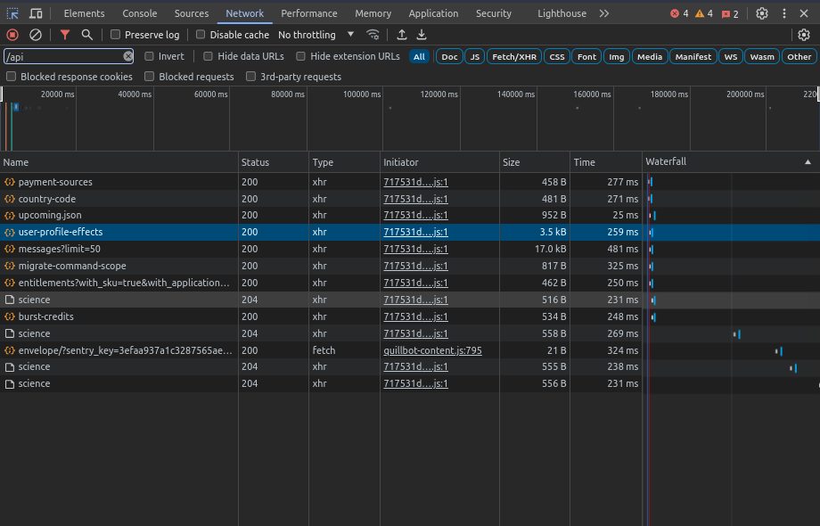

# MidJourney README

## Disclaimer

Current Midjourney tool works primarily with face images and for now can send the “imagine” request, interact with the response from “imagine” request and send the “describe” request, getting the list of descriptions.

! To use current tool, active subscription to Midjourney is required

## Installation

```bash
git clone https://github.com/treoa/midjourney-augmentation.git
```

## Configuration

1. Firstly, login from browser to the [Discord web app](https://discord.com/app). After logging in, proceed to the desired server and channel by selecting them in the web version. Then you would see in the address bar something like: `discord.com/channels/[SERVER-ID]/[CHANNEL-ID]`
    
    Copy those `SERVER-ID` and `CHANNEL-ID` variables into `config.json` file.
    
2. Then go the to the same page, open Command Center with Ctrl+Shift+C
3. Go the the “Networks” tab and reload the page
    1. Input “/api” in the filter bar of command center and look for file called like “library” or “user_profile”
        
        
        
    2. After clicking on it, go to the “Headers” tab and look for “Authorization” variable under the Request Headers. That value will be our `DISCORD-TOKEN`
    3. Copy that value into the `config.json` file

## Get started

```python
from midjourney_augmentation import DescribeService
from midjourney_augmentation import ImagineService
from midjourney_augmentation.helpers import GetResponse
```

Above we imported basic needed objects. Now, after we have updated `config.json` file and imported needed services, we initiate these services to further work with them

```python
describe_service = DescribeService()
imagine_service = ImagineService()
```

If further we have updated configs, or we do not want to work with `config.json` file, we can send our `discord_token`, `server_id`, and `channel_id` by init of services, like:

```python
describe_service = DescribeService(discord_token, server_id, channel_id)
```

To work with DescribeService, we just need to pass the image as the `file` variable. That variable can be link, as well as the path to the image locally

Note:

- If we want to pass the file as link, we need to indicate full link, that begins with “http(s)://”
- If we want to pass the file as path, we need to indicate full path. Better to do that with `os` library like following `os.path.join(os.getcwd(), "FURTHER_PATH_TO_THE_IMAGE")`

```python
filename = "FULL_LINK_OR_PATH"
descriptions = describe_service.get_descriptions(file=filename)

print(descriptions)
```

`get_descriptions` method returns the list of formatted descriptions that Midjourney gave

```python
imagine_service.imagine(prompt=descriptions[0], realism=True, close_up=True)
imagine_service.get_option_from_generated(idx=1, crop=True)
```

Above we passed the first received before descriptions to the imagine. You also can manually write your prompt string instead of `descriptions[0].`

`realism` stands for adding an additional prompt for realistic images

`close_up` stands for close_up shot. Used to indicate when we are working with images of people

Then getting the response from imagine command, we instantiate the new request of selecting the upscaling of 2nd image as passing `idx=1` variable to the `get_option_from_generated()` method.

Finally, we have a saved as `image_{highest_idx}.jpg` and `image_{highest_idx}_cropped.jpg` files of the generated formerly image locally, where script is running.